# AWS learning

## Reserved instances

## Spot instances

## Dedicated host

## Bucket Versioning.

## EBS VS S3 Vs EFS

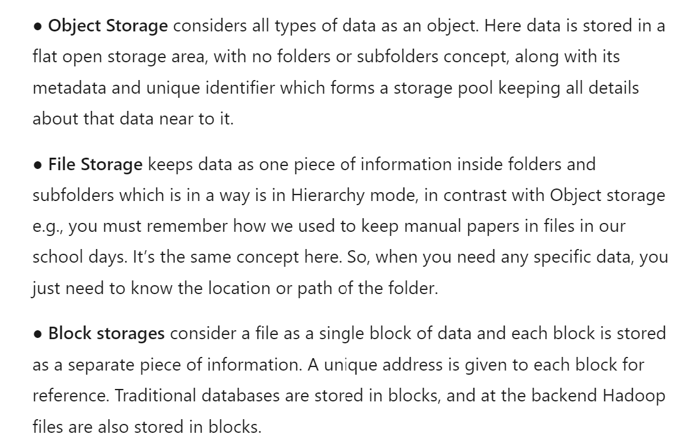
factors to consider before selecting storage.
 - performance
 - cost
 - Avaialbility and durability
 are major 3 things to consider.
 
rough representation
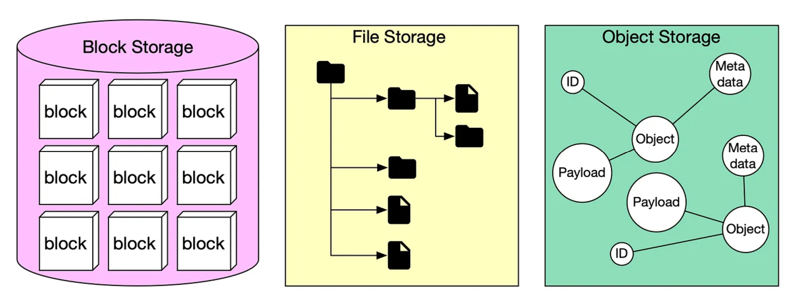

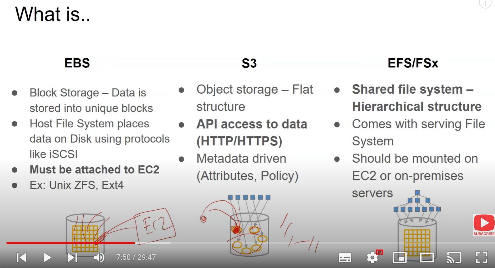

### ***EBS volume***
`architecture:`
- scope level is AZ (avaialbility zone) level.

`use case:`
- attacht to EC2 instance as blcok storage.
### ***s3 ***
`architecture:`
- scope is regional. 

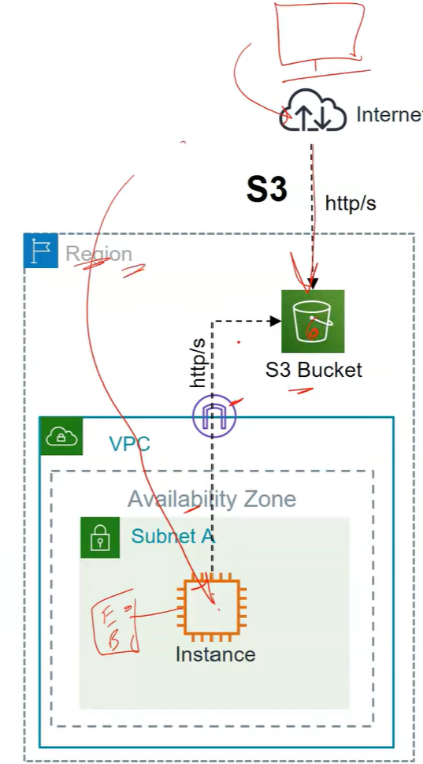

`use case:` 
- storing picture and videos.

### ***EFS***
`architecture:`
- scope is regional. 

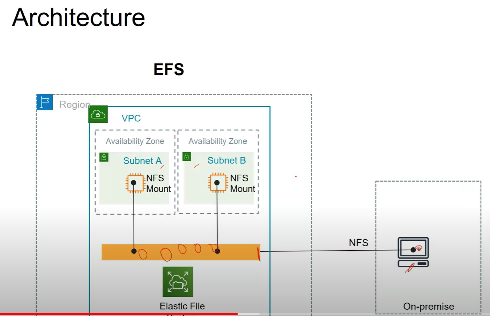

`use case:` 
- used to shared the same storage accross multiple instances.
- can be shared with on-premise as well.
- uses NFS protocal.

### Availabilitya and Durability of each
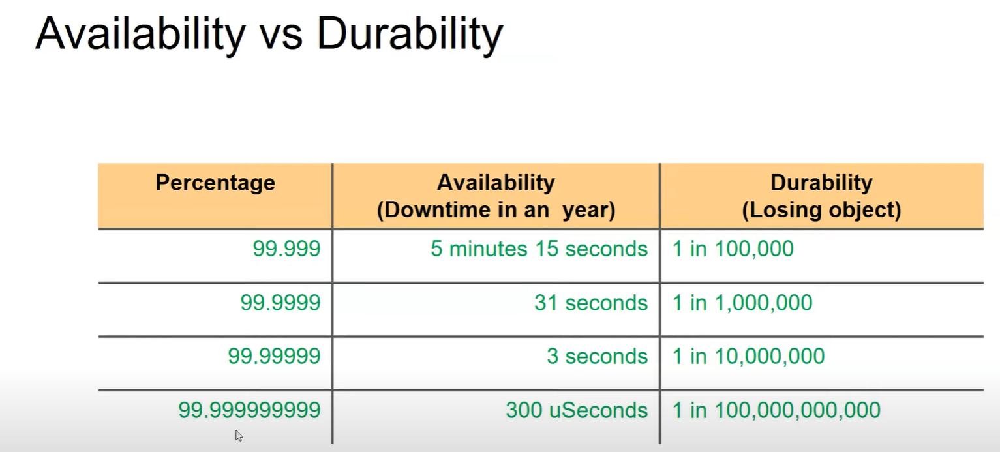
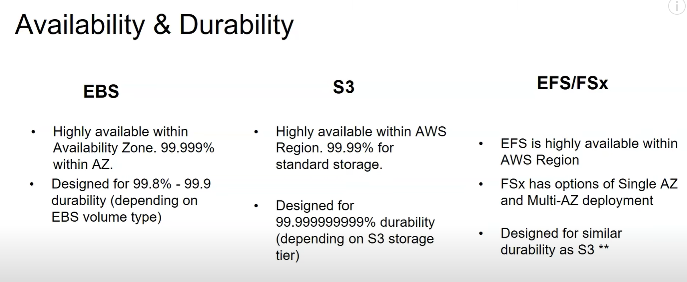

### Performance measure.
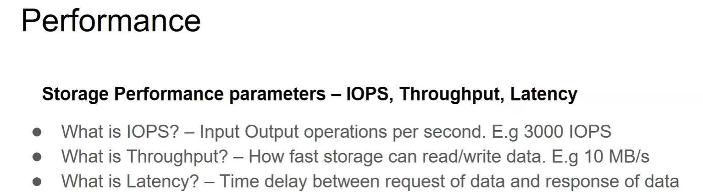
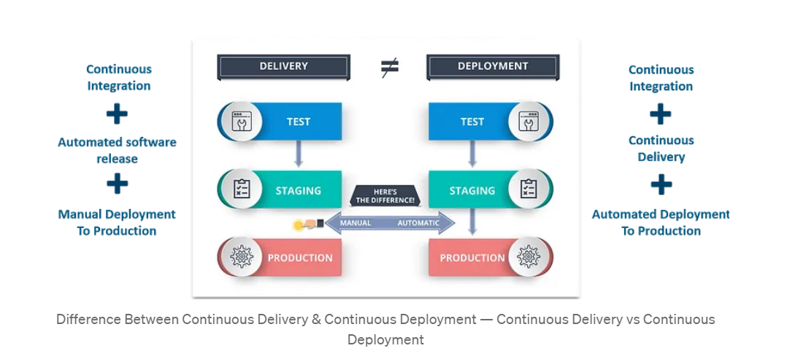

### Cost.
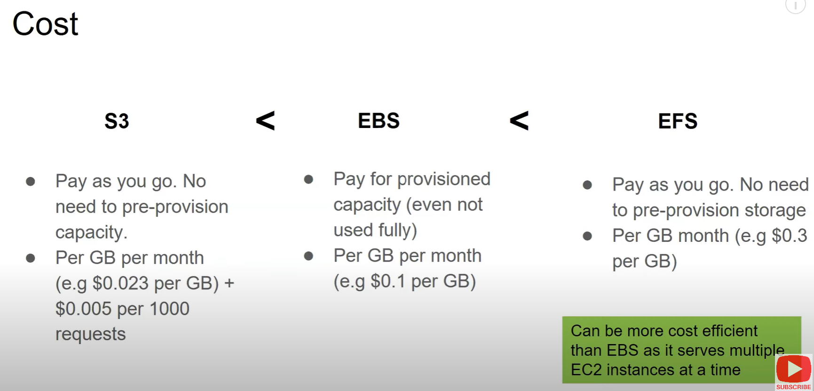

### Decision tree.
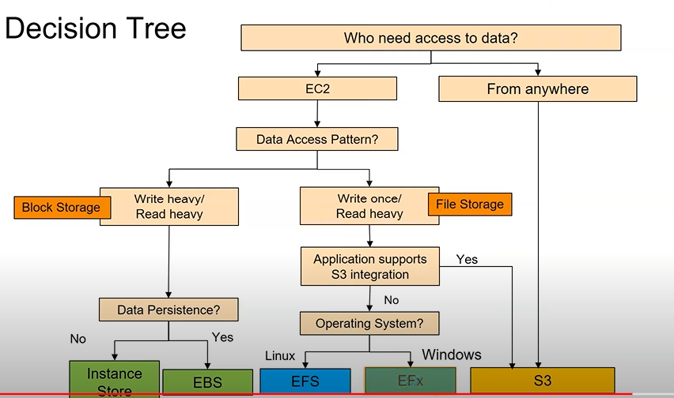

## DNS Resolver

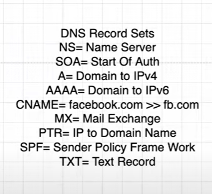

## Web server VS Application server.

web servers are used to serve the webcontenet where as appliacaiton servers are used to write the bussiness logic.

ex: flipkart.com.

where application server is exposed to internet like adding cart and saving it without login into flipkart accout.

`SSL termination` - happens at ALB and best place to stre the ssl cerificare is ALB.

## ALB vs NLB
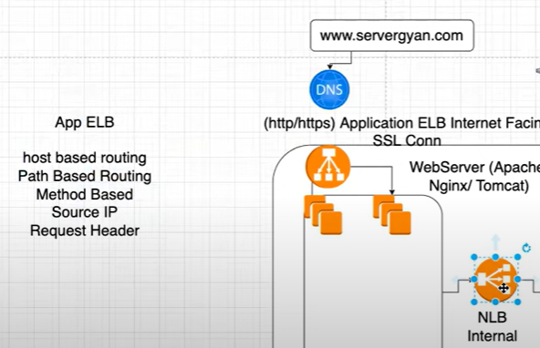
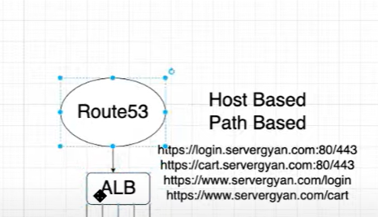
ALB supports more fature as in image 19. 
works on layer 7 application layer.

while as NLB cannot and NLB have hig throughput and low latency.
works on layer 4 transport layer.

## algorithms followed on LB level.
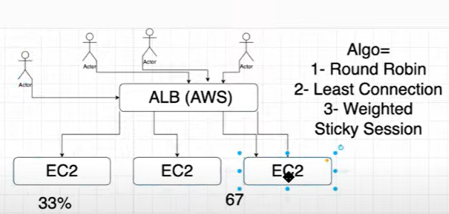

## CIDR calculation

check with youtube "AwS with Chetan"

## instance 2/2 check

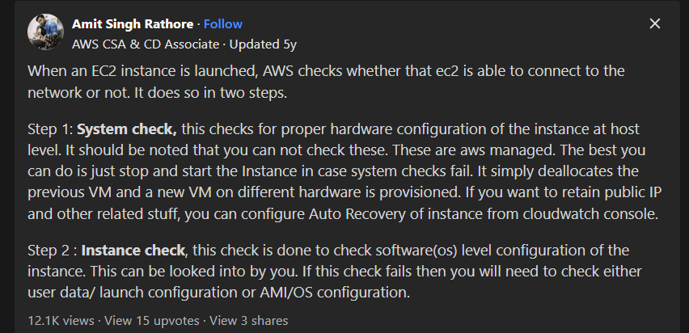

## KMS encryption working

[source for KMS encryption working](https://medium.com/@rohnux_26/encryption-of-data-using-aws-kms-b9f71f77696c)

