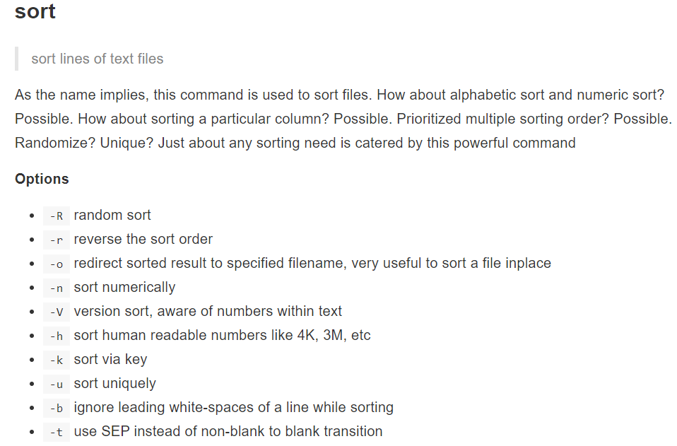

[sorce for text processing and there flags](https://learnbyexample.gitbooks.io/linux-command-line/content/Text_Processing.html)

[basic text processing](https://earthly.dev/blog/linux-text-processing-commands/)

[advantages of shell scripting](https://safiakhatoon.hashnode.dev/shell-scripting-tutorial-beginners-to-advanced)

[text proccessing values wise](https://www.linuxteck.com/text-processing-commands/)

- [subheasing](#test-for-subheading-referemce)

# test-for-subheading-referemce

# Sort

# uniq

# cmp

# diff

# sed

