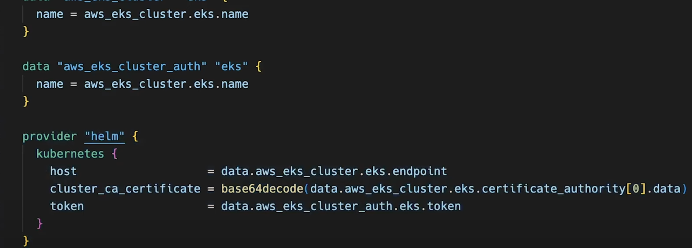

# k8s learning

## control plane controller


## liveness probe


"this is use to check the containers health status" if found unhealthy replaces with new container

## readyness probe
application need tobe ready before we add it to backend service pool.

for ex: app need to connect with database, till this connection is establised the pod will simply remove the ip-address from endpoints of service

by saying pod is not ready.


## RBAC 


## POD priority


create the priority class and assighn them to pods
can be alloated with deployment or with pods directly


## pod disruption budget & drain
PDB handles only volanry(intentional) disruption,when disruption id tiggered, the PDB will hit eviction API and takes the action.


## ETCD bakup ways
way to take ETCD backup

1. get the endpoint of etcd
2. certificate to authenticate to the ETCD server
3. we can retrive endpoint and certificate from the etcd pod
  under /etc/kubenteres/manifeast file

```bash
    cat /etc/kubernetes/manifests/etcd.yaml |   grep listen
```

cat /etc/kubernetes/manifests/etcd.yaml | grep file

---once we have cert and endpoint,snapshot run as below-----
```bash
ETCDCTL_API=3 etcdctl --endpoints=https://127.0.0.1:2379 \
--cacert=/etc/kubernetes/pki/etcd/ca.crt \
--cert=/etc/kubernetes/pki/etcd/server.crt \
--key=/etc/kubernetes/pki/etcd/server.key \
snapshot save <backup-file-location>
```
------restore command--------
```bash
ETCDCTL_API=3 etcdctl --data-dir="/var/lib/etcd-backup" \
--endpoints=https://127.0.0.1:2379 \
--cacert=/etc/kubernetes/pki/etcd/ca.crt \
--cert=/etc/kubernetes/pki/etcd/server.crt \
--key=/etc/kubernetes/pki/etcd/server.key \
snapshot restore etcd-backup.db
```

## Set Context/kubeconfig
set the context for particular namespaces or switch between cluster


## Config Map


Limitation of config map


## secrets types


## Secrets Vs configmap


## ingress 
ALB is created along with ingress only.


## Continous delivery VS continous deployment


## INGRESS 


## Network policies


## PVCs access modes


## Deployemnt strategies

allows you to upgrade your apps without downtime.

### Rolling update


rolling update is like replacing all pods with new ones.
- `maxunvailable` default 25% which implies that up to 25 percent of pods can be down at any given time.

- `maxsurge` many number of pods can be created over the desired size of deployment, default is 25% means if repicas is 4 with max surge it deploy 5 pods that is 125% of desired.


Rollbacking the update in deployemnts as below.


### Recreate

kills all the pods and then redeploys again, experiences downtime, not suaitable for prod


### Blue Green Deployments

traffic is distributed to new blue deployment slowly with percentage of around 20 percent, then 50 then 70 , once we see that new deployemnt is running traffic will be shifted to new deployment.

then service file also will be modified to green lable.


## Replica Set

[Replica set explanation](https://medium.com/@mrdevsecops/kubernetes-replicaset-7dbc1ceb5268)


## Source 
[devopscube](https://devopscube.com/kubernetes-architecture-explained/)

## HPA


## Basic commands


## POD Eviction


## Deployment vs statefulset


## Deployment vs replicaset
[rolling update strategy](https://tachingchen.com/blog/kubernetes-rolling-update-with-deployment/)


## Service dicovery


to do the service discovery 
`lables and selcetors` are responsible.
- So when ever the pod fails and restarts it will be craeted with new ip address, then request from LB will not reach the configured ip. 

to solve this service dicovery will discover the pods with lables in metadata and sends the request to the particular labled pods.

for example if request needs to go to payments pod then it will not search for nay ip, instead service dicovery will find it with lable as below
```yaml
 - metadata
      lables: 
         app: payments
```
Cluster IP works on service dicovery.

## Ingress
- important thing to check so that when using multiple ingress contollers like conbinations of inginx and HA proxy. so that each contoller access desired ingress.

for that ingress class need to be set as below.


## SSL bridging

- re-encryption of packet from LB to app
 
- SSL pass through is also same, but it passed the packet directly to app

## DEEVSECOPS 
Parameters to in terms of kubenetes security.


## Toubleshooting IMAGE PULL BACKOFF of pods

image pull secret

the secret is created in kubenetes with docker credentials to access the private repository.


- first we will get image pull error and then we have backoff
this backoff works on delay
for example: if image is failed to pull on first attemt then it will wait for few seconds, and then gain try to pull if it still fails then again it will wait for few seconds but, this time it will add more delay and consecutively process goes on, at one point it will fail.

`resons of faiure` this can be as below
- invalid image
- non exitence image
- permission denied.

### AWS EKS Setup

 - network creattion
 - creating the access policies as below and also OIDC along with cluster for providing access with service account of kubenetes

 

 - `AWSEKS worker nodes policy` - provides the access on ec2 instances.
 
 - `AWS EKS CNI(coantaiiner network interface)-Policy` - this is the add on to EKS "VPC-CNi" , responsibe for Ip- address configuration on worker nodes.

 - `Aws EC2 container regitry readonly acces` - reposible to provide acceess to ECR to pull the iamges.

- command to chekc the acces to cluster 


iam roles for groups and RBAC and role bidings

adding progfiels to different user groups as below


similarly we can add this to `aws onfigure` as below

```bash
  aws configure --profile manager
```

- for working of HPA resources needs to be added in deployemnt or nay resource file as below


- Metrics server for HPA, deploying metric server with helm  uing terraform


need to provide the helm in terraform providers as below.


- if resources are not defined HPA will not show the TARGETS coloumns whcih is unknown


## Cluster auto scaler(EKS Pod identites)


## CSI (Container Storage Interface) Drive -

EBS CIS driver helps in providing or setting the EBS volumes to statefulset.

EBS CSI (container storage interface) is an add on in eks and need the role to make the aws API calls.

